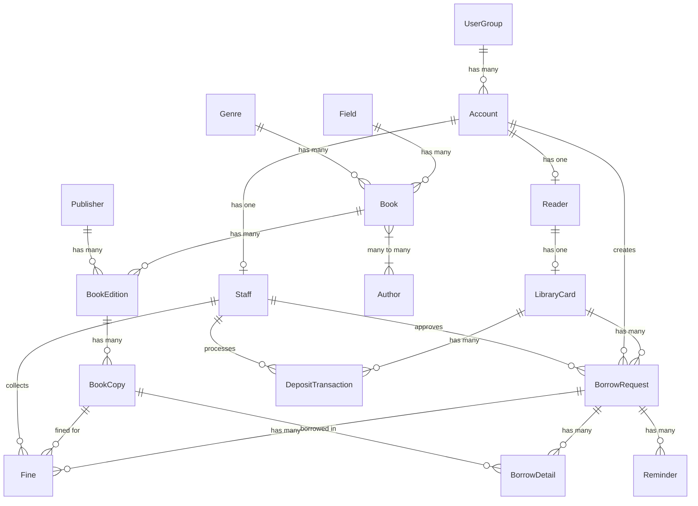

# Kế hoạch tạo dữ liệu Seed chuẩn

## Tổng quan

File này mô tả kế hoạch tạo dữ liệu seed phù hợp với cấu trúc model hiện tại và các thay đổi sắp tới của hệ thống quản lý thư viện.

## Sơ đồ quan hệ Models



## Các thay đổi cần áp dụng cho Seed

### 1. ❌ Xóa `page_count` và `size` khỏi Books

```javascript
// TRƯỚC (cần xóa)
{ code: 'CNTT001', title: 'Lập trình Java', page_count: 350, size: '16x24cm', ... }

// SAU
{ code: 'CNTT001', title: 'Lập trình Java', ... }
```

### 2. ✅ Đảm bảo `price` trong BookCopy

Mỗi `book_copy` BẮT BUỘC phải có giá (`price` > 0):

```javascript
{ book_edition_id: 1, copy_number: 1, price: 120000, status: 'available', ... }
```

### 3. ✅ Thêm `established_date` cho Publisher

```javascript
{ 
    name: 'NXB Giáo dục Việt Nam', 
    address: 'Hà Nội',
    established_date: '1957-06-01',  // Ngày thành lập
    phone: '024-3822-0801',
    email: 'info@nxbgd.vn'
}
```

### 4. ⚠️ 1 Phiếu mượn = 1 Sách

**Thay đổi logic:** Mỗi `borrow_request` chỉ có 1 `borrow_detail`

```javascript
// TRƯỚC: 1 phiếu có nhiều sách
borrowDetails = [
    { borrow_request_id: 1, book_copy_id: 1 },
    { borrow_request_id: 1, book_copy_id: 2 },  // Không hợp lệ nữa
];

// SAU: 1 phiếu = 1 sách
borrowDetails = [
    { borrow_request_id: 1, book_copy_id: 1 },
    { borrow_request_id: 2, book_copy_id: 2 },  // Phiếu riêng
];
```

### 5. ✅ Trạng thái sách bị mất → `disposed`

Khi sách bị mất:
- `status` = `'disposed'`
- `condition_notes` = `'[MẤT SÁCH] Ghi chú...'`

```javascript
{ book_edition_id: 5, copy_number: 3, price: 80000, status: 'disposed', condition_notes: '[MẤT SÁCH] Độc giả làm mất ngày 15/01/2026' }
```

## Cấu trúc Seed Data mới

### Thứ tự Insert (theo dependency)

1. **user_groups** (admin, librarian, reader)
2. **accounts** (admin, librarian, readers x10)
3. **staffs** (liên kết với admin/librarian accounts)
4. **readers** (liên kết với reader accounts)
5. **library_cards** (liên kết với readers)
6. **deposit_transactions** (liên kết với library_cards, staffs)
7. **system_settings**
8. **fields** (8 lĩnh vực)
9. **genres** (8 thể loại)
10. **publishers** (8 NXB, có established_date)
11. **authors** (10 tác giả)
12. **books** (15 sách, KHÔNG có page_count/size)
13. **book_authors** (quan hệ N-N)
14. **book_editions** (16 phiên bản)
15. **book_copies** (60+ bản sách, CÓ price)
16. **borrow_requests** (nhiều phiếu, MỖI PHIẾU 1 SÁCH)
17. **borrow_details** (1-1 với borrow_request)
18. **fines** (phạt quá hạn/hư hỏng/mất)
19. **reminders** (nhắc trả)

### Dữ liệu mẫu chi tiết

#### Publishers với established_date

| Tên NXB | Ngày thành lập |
|---------|----------------|
| NXB Giáo dục Việt Nam | 1957-06-01 |
| NXB ĐHQG Hà Nội | 1995-01-15 |
| NXB ĐHQG TP.HCM | 1996-09-01 |
| NXB Khoa học và Kỹ thuật | 1960-08-20 |
| NXB Trẻ | 1981-04-08 |
| NXB Kim Đồng | 1957-06-01 |
| NXB Lao động | 1946-10-15 |
| NXB Thống kê | 1975-08-01 |

#### Books (bỏ page_count, size)

| Code | Title | Field | Genre |
|------|-------|-------|-------|
| CNTT001 | Lập trình Java cơ bản | CNTT | Giáo trình |
| CNTT002 | Cấu trúc dữ liệu | CNTT | Giáo trình |
| CNTT003 | Trí tuệ nhân tạo | CNTT | Tham khảo |
| ... | ... | ... | ... |

#### BookCopies (bắt buộc có price)

| Edition | Copy# | Price | Status | Notes |
|---------|-------|-------|--------|-------|
| 1 | 1 | 85,000 | available | |
| 1 | 2 | 85,000 | borrowed | Đang mượn |
| 1 | 3 | 85,000 | damaged | Bìa rách |
| 2 | 1 | 120,000 | disposed | [MẤT SÁCH] |

#### BorrowRequests (1 phiếu = 1 sách)

| ID | Reader | BookCopy | Status | Notes |
|----|--------|----------|--------|-------|
| 1 | Reader001 | Copy#5 | returned | Đã trả |
| 2 | Reader002 | Copy#8 | borrowed | Đang mượn |
| 3 | Reader003 | Copy#12 | overdue | Quá hạn 10 ngày |
| 4 | Reader004 | Copy#15 | pending | Chờ duyệt |
| 5 | Reader005 | Copy#18 | approved | Chờ nhận sách |

## Files cần sửa

### Backend

1. **`backend/src/models/Book.js`**
   - Xóa trường `page_count` (dòng 53-58)
   - Xóa trường `size` (dòng 60-65)

2. **`backend/seeders/20240114000001-initial-data.js`**
   - Xóa `page_count`, `size` trong books
   - Thêm `established_date` cho publishers
   - Đảm bảo có `price` trong book_copies
   - Đổi logic: 1 borrow_request = 1 borrow_detail
   - Thêm các trường hợp sách mất (disposed)

### Migrations cần tạo

```bash
# Tạo migration xóa page_count và size
npx sequelize-cli migration:generate --name remove-page-count-size-from-books
```

```javascript
// Migration template
module.exports = {
    up: async (queryInterface) => {
        await queryInterface.removeColumn('books', 'page_count');
        await queryInterface.removeColumn('books', 'size');
    },
    down: async (queryInterface, Sequelize) => {
        await queryInterface.addColumn('books', 'page_count', { type: Sequelize.INTEGER });
        await queryInterface.addColumn('books', 'size', { type: Sequelize.STRING(20) });
    }
};
```

## Chạy Seed

```bash
cd backend

# Xóa data cũ và reset
npx sequelize-cli db:seed:undo:all

# Chạy migration (nếu có)
npx sequelize-cli db:migrate

# Chạy seed mới
npx sequelize-cli db:seed:all
```

## Checklist validation

- [ ] Tất cả `book_copies` có `price` > 0
- [ ] Không có `page_count` hay `size` trong `books`
- [ ] Tất cả `publishers` có `established_date`
- [ ] Mỗi `borrow_request` chỉ có 1 `borrow_detail`
- [ ] Có các trường hợp sách `disposed` với ghi chú `[MẤT SÁCH]`
- [ ] Có các trường hợp sách `damaged` với ghi chú tình trạng
- [ ] LibraryCard liên kết đúng với Reader
- [ ] Account liên kết đúng với UserGroup
- [ ] BookCopy.status phải khớp với BorrowDetail (nếu đang mượn thì status='borrowed')
